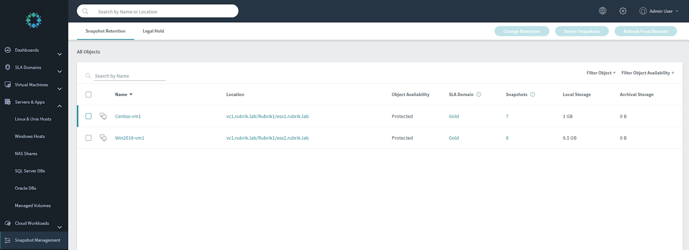
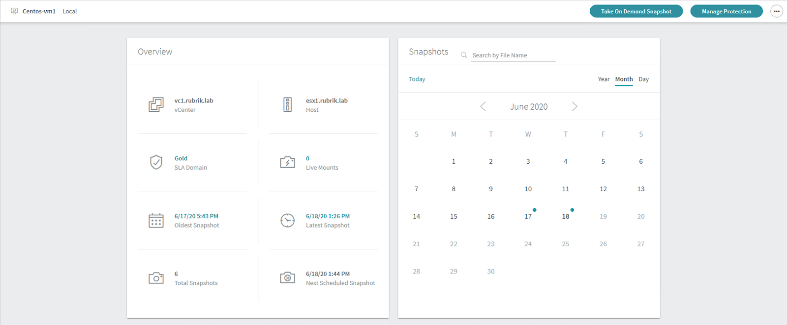

# Snapshot Management

A data object, such as a snapshot or backup, is an unmanaged object when any of the following circumstances are true:

* Data source is no longer available to the Rubrik cluster.
* Data source was removed from an SLA Domain and not added to another SLA Domain.
* Data object was created on-demand and without a retention policy.
* Data object is a replica that is no longer associated with the replication source.
* Data object is an archival copy that was retrieved from an archival location.

In each of these cases the data object does not have a retention policy to control the life of the data. Data objects without a retention policy are called unmanaged objects.

The Snapshot Management page may be used to initiate management tasks for unmanaged objects and consists of two levels: data source level and object level. The data source level provides information about the virtual machines, applications, and filesets that are the source of the unmanaged object data. The object level provides information about the individual unmanaged objects of a selected data source.

On the left-side menu, click **Snapshot Management**.

The data source level of the Snapshot Retention page appears.

In the **Name** column, select the name of a data source.

The local host page or Recovery Points card page appears.

Tasks \(such as Instant Restore, Live Mount, etc.\) may be conducted with the data available through the Snapshots panel. Please do not conduct any tasks against an Unmanaged Object at this time.

You have now completed the Exploration badge! Raise your hand so a Rubrik employee can get you the badge, answer any questions about this section, and give an overview of the next section.

