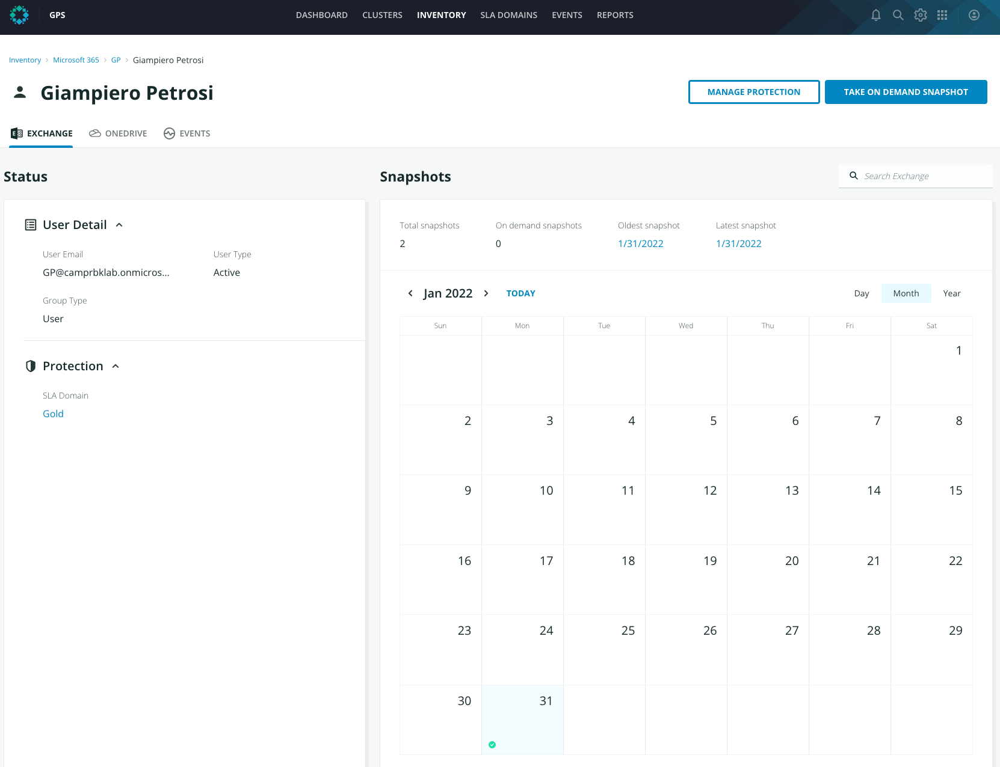
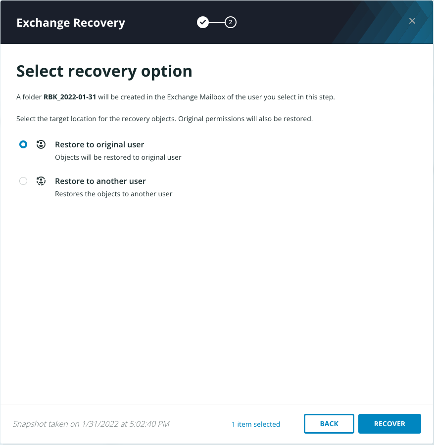

# Restore an M365 Exchange email

To recover an M365 email from Polaris:

In the web UI, click **Exchange inventory card** > **View Users**. The Users page appears, with the list of all the Exchange Users.

Click on the email account of the User.

 Highlight.png>)

The **Overview** pane provides information regarding the object’s location, the SLA Domain applied, Oldest and Latest Snapshot, total snapshots, etc. This can vary depending on location and type of object. On the right-hand side there is a **Snapshots** calendar view. The next few steps will guide you on your journey to explore this more.

Select a date that has a blue dot by hovering over and then clicking on the blue dot (indicating there are recovery points from this day). All available snapshots are listed. An example screenshot below demonstrates all of the snapshots available for the selected mailbox. Note that the date and number of snapshots may differ from the following image.

Select the ellipses icon (`...`) next to one of the snapshots.

Click **Recover**. Next type in the search bar the word `update`. Four emails are shown.

Click on the checkbox in front of the `Weekly digest: Microsoft service update` and then click **Next**.

There are two options shown: **Restore to original user** and **Restore to another user**.

Do not select any of the options at this time and click  to exit the dialog.


**Trail Map:**

_Restore to original user_ - email restored directly on the original mailbox but in a dedicated folder.

_Restore to another user_  - email restored on a selected mailbox but in a dedicated folder.


In the Exchange Recovey UI, browse the content click on the Name.

 Highlight.png>)

Browse the content of the mailbox.&#x20;

.png>)

Go to **Inbox** and Click on the checkbox in front of the `Weekly digest: Microsoft service update` and then click **Next**.

Choose **Restore to original user** and Click on **Recover**.

This may take a few moments. Click on the **Events** icon  in the top left menu of the Rubrik UI to review the notification informing you that the email is restored.

On your browser access the Office 365 environment.
