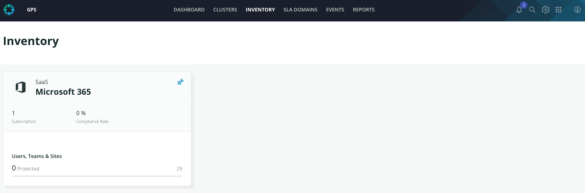

# Setting up a subscription - Rubrik Hosted

Log in to the Polaris web UI.

On the navigation bar, click **Inventory**.

The **Inventory** page appears.

Subscription is already configured. Click on the Microsoft 365 inventory card.

The Microsoft 365 dashboard appears.

Click **Add Subscription**.

Click **Add Subscription**.

Select an Azure region for the data plane and click Next.&#x20;

.png>)

Polaris creates the new Microsoft 365 subscription.

Granting Access to the application listed you will subscribe the Rubrik service and you will be able to protect its content. Do not configure a new subscription at this time.


**Important:**

_Do not configure a new subscription. Click on the_  to close the wizard and abort the configuration.



**Setup:**

_The setup of Azure resources takes about 20 minutes. Based on the number of objects in the Microsoft 365 subscription, Polaris takes several more minutes to update the Inventory page._


__
