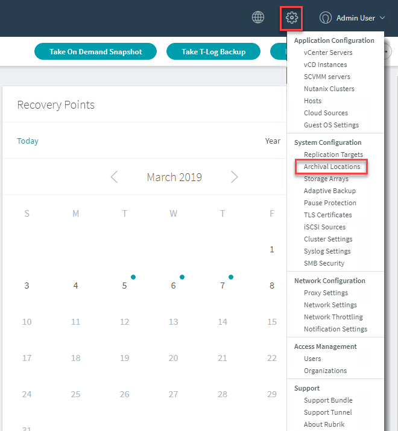
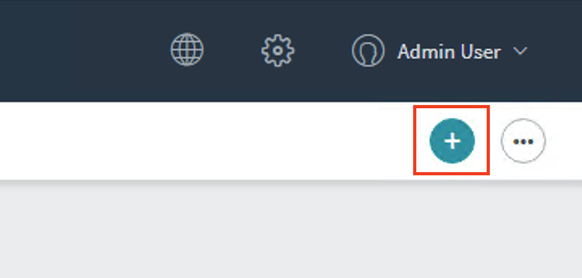
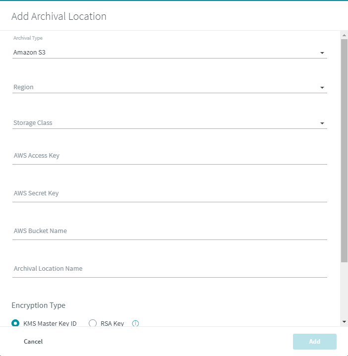

# Adding a Cloud Archive Location

Using Amazon S3 as an example, let’s walk through adding an archive location:

Click on the gear icon located on the top right bar of the web UI.

The Settings menu appears.

From the **Settings** menu, select **Archival Locations**.

The Archival Locations page appears.

Click the blue **+** icon.

The Add Archival Location dialog box appears.

In **Archival Type**, select **Amazon S3**.

The Amazon S3 archival location fields appear.

Review the different inputs required for Amazon S3 as an archive. Feel free to browse other archive types to view required settings.

Press **Cancel** when finished.

On the left pane of the web UI, select **SLA Domains** &gt; **Local Domains**. The Local SLA Domains page appears.

Select the Camp Rubrik SLA Domain that you previously created. The SLA Domain page will load.

Click the ellipses \(`...`\) at the top right corner of the SLA Domain page. Select **Edit**.

Click **Next** to view the **Set Archiving and Replication** pane.

In Archiving, click the toggle \(if not already done\). Notice the **Enable Instant Archive** option. Do not select it at this time although you can click the circled “`i`” to read what it does.

The Instant Archive feature can be enabled to instruct a Rubrik cluster to immediately queue a task to copy a new snapshot to a specified archival location.

Press **Cancel**.

